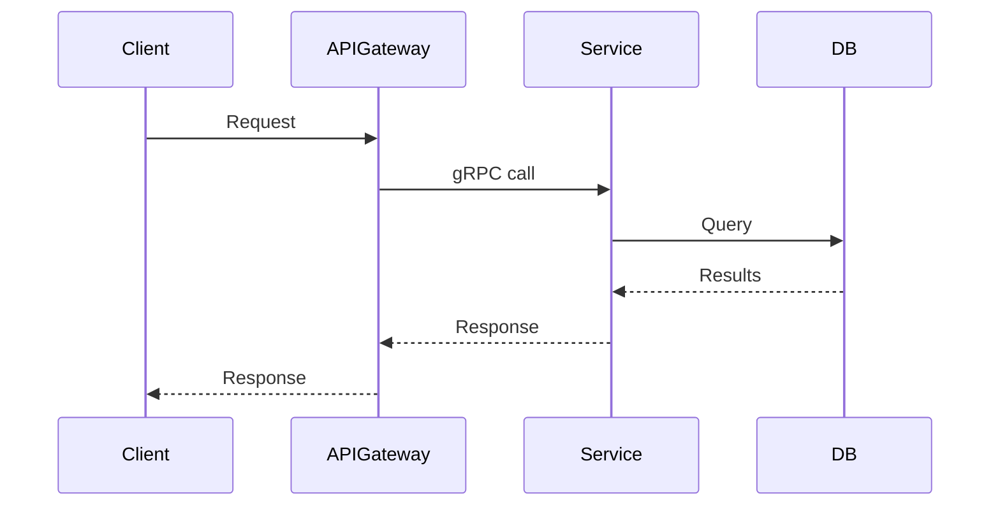

# Create PR

Create a draft GitHub pull request with a standardized, concise description.

## Prerequisites

- Commits are ready (check `jj log` / `jj status`)
- A bookmark exists and is pushed, or will be created
- Plan doc and/or ticket context is available for the "Why" section

## Workflow

### 1. Gather Context

- Read the plan doc (`plan-<TICKET>.md`) if available
- Read the progress doc (`progress-<TICKET>.md`) if available
- Check ticket context (from MCP or user-provided)
- Run `jj log` to see the commit stack that will be in this PR
- Run `jj diff -r <first-change>::<last-change>` to understand the full scope of changes

### 2. Set Up Bookmark & Push

```bash
# Set bookmark on the latest implementation commit (NOT the empty working copy)
jj bookmark set tausman/<ticket-short-description> -r <last-implementation-change-id>

# Push to remote
jj git push --bookmark tausman/<ticket-short-description>
```

### 3. Write PR Description

Follow this exact structure:

```markdown
## Why
<1-3 sentences explaining WHY this change is needed. Reference the ticket and the
business/technical motivation. This PR may be one piece of a larger effort -- frame
it in that context. Be concise.>

## Summary
- <bullet point summarizing what this PR does at a high level>
- <another bullet point>
- <keep to 3-5 bullets max>

## Changes
- **<Component/Area>**: <what changed>
- **<Component/Area>**: <what changed>
- **<Component/Area>**: <what changed>

## Test plan
- [x] <test that was run and passed>
- [x] <another test>
- [ ] <test that still needs to be done, if any>

## Follow-up
- <anything that comes next, blocked-on items, future PRs>
```

### 4. Add Diagrams for Larger Changes

For PRs that involve interactions between services, components, or data flows, add a diagram after the Summary section.

**Use a mermaid diagram when the interactions are complex:**

````markdown
## Architecture


````

**Use ASCII art for simpler interactions:**

```markdown
## Architecture

    dogweb                    ACE PAT Service              OrgStore
    ┌──────────┐   gRPC      ┌──────────────┐   sqlx     ┌─────────┐
    │ cleanup  │────────────→│  new endpoint │───────────→│  PATs   │
    │ job      │←────────────│              │←───────────│  table  │
    └──────────┘  UUIDs[]    └──────────────┘  rows      └─────────┘
```

**When to include a diagram:**
- PR touches multiple services or repos
- New API endpoints or gRPC methods are added
- Data flow is non-obvious
- Reviewer needs to understand the interaction model

**Skip diagrams for:**
- Single-file or small changes
- Pure refactors within one component
- Test-only changes

### 5. Create the PR

**Always create as draft.** No exceptions.

```bash
gh pr create --draft \
  --title "<TICKET-ID> <concise imperative summary>" \
  --body "$(cat <<'EOF'
## Why
...

## Summary
...

## Changes
...

## Test plan
...

## Follow-up
...
EOF
)"
```

### 6. Detect and Link Related PRs (PR Stack)

After creating the PR, check if there are other PRs that are part of the same body of work (same ticket ID):

```bash
# Find open PRs with the same ticket ID in the title
gh pr list --state open --json number,title,url --jq '.[] | select(.title | test("TICKET-ID"))'
```

If related PRs exist (including the one just created), append a `## PR Stack` section to **every** related PR's description.

**Single-repo stack:**

```markdown
## PR Stack
- **#101 CRED-2174 Add proto definitions** (this PR)
- #102 CRED-2174 Add gRPC server implementation
- #103 CRED-2174 Add integration tests
```

**Cross-repo stack** (when PRs span multiple repos):

```markdown
## PR Stack

### repo-name-1
- **#101 CRED-2174 Add proto definitions** (this PR)
- #102 CRED-2174 Add DB layer

### repo-name-2
- [repo-name-2#45](https://github.com/org/repo-name-2/pull/45) CRED-2174 Add gRPC client integration
- [repo-name-2#46](https://github.com/org/repo-name-2/pull/46) CRED-2174 Add cleanup job
```

To detect cross-repo PRs, search related repos:
```bash
# Search for PRs with the same ticket ID across repos
gh pr list --repo <org/other-repo> --state open --json number,title,url \
  --jq '.[] | select(.title | test("TICKET-ID"))'
```

Rules:
- List PRs in creation order (oldest first) within each repo
- Bold the current PR and mark it with `(this PR)`
- **Same repo**: use `#<number>` shorthand (GitHub auto-links these)
- **Cross repo**: use full markdown link `[repo#num](URL)` (GitHub doesn't auto-link across repos)
- Group by repo name using `###` subsections when multiple repos are involved
- Update **all** related PRs across **all** repos, not just the new one
- If this is the only PR for the ticket (single repo, single PR), skip this section

```bash
# Update each related PR's body to include the stack section
gh pr edit <number> --body "$(cat <<'EOF'
<existing body with PR Stack replaced or appended>
EOF
)"
```

### 7. Report

After creation, present:

```
PR created (draft): <URL>
Title: <title>
Branch: tausman/<description>
```

If related PRs were linked:
```
PR Stack updated across <N> PRs:
- #101 <title>
- #102 <title>
- ...
```

## PR Title Format

```
<TICKET-ID> <concise imperative summary of what the PR does>
```

Examples:
- `CRED-2174 Add GetDistinctPATPermissionGroupUUIDs gRPC endpoint to ACE`
- `LOGS-1234 Fix consumer lag calculation for partitioned topics`
- `CRED-2200 Update PAT expiration validation to support custom TTLs`

Rules:
- Ticket ID first
- Imperative mood ("Add", "Fix", "Update" -- not "Added", "Fixes", "Updates")
- Concise -- the description goes in the body, not the title

## Updating a PR

Whenever changes are pushed to an existing PR branch (new commits, amended commits, rebases), **always update the PR description to reflect the current state**. This applies whether the update is triggered by the user asking to push, or as part of `/implement-plan` or `/iterate-plan`.

### What to update

1. **Summary** -- should reflect what the PR does _now_, not what it did when first created
2. **Changes** -- add/remove/modify entries to match the current diff
3. **Test plan** -- update with any new tests run, mark completed items
4. **Follow-up** -- update if scope has changed
5. **PR Stack** -- re-detect related PRs and refresh the stack section in all linked PRs
6. **Architecture diagrams** -- update if the design has changed

### How to update

```bash
# Get the current PR body
gh pr view <branch> --json body --jq '.body'

# Revise the body to match current state, then:
gh pr edit <branch> --body "$(cat <<'EOF'
<updated body>
EOF
)"
```

### When NOT to update

- Cosmetic rebases with no content change -- skip the description update
- If the PR is already merged or closed

## Key Principles

- **Always draft** -- PRs are created as drafts, always
- **Why first** -- the reviewer should understand motivation before reading changes
- **Concise** -- every section should be scannable, no filler
- **Concrete changes** -- group by component, be specific about what was modified
- **Test plan is real** -- list actual tests that were run, not hypothetical ones
- **Diagrams when helpful** -- visualize service interactions for larger changes, skip for small ones
- **Description is always current** -- PR description reflects the current state of the branch, updated on every push
- **Stack links stay fresh** -- related PRs are always linked and kept in sync
