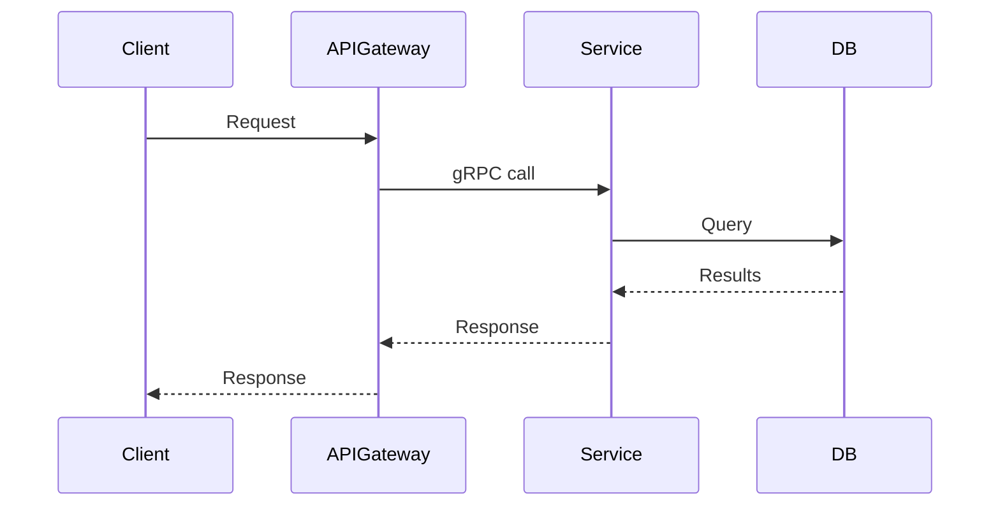

# Create PR

Create a draft GitHub pull request with a standardized, concise description.

## Prerequisites

- Commits are ready (check `jj log` / `jj status`)
- A bookmark exists and is pushed, or will be created
- Plan doc and/or ticket context is available for the "Why" section

## Workflow

### 1. Gather Context

- Read the plan doc (`plan-<TICKET>.md`) if available
- Read the progress doc (`progress-<TICKET>.md`) if available
- Check ticket context (from MCP or user-provided)
- Run `jj log` to see the commit stack that will be in this PR
- Run `jj diff -r <first-change>::<last-change>` to understand the full scope of changes

### 2. Set Up Bookmark & Push

```bash
# Set bookmark on the latest implementation commit (NOT the empty working copy)
jj bookmark set tausman/<ticket-short-description> -r <last-implementation-change-id>

# Push to remote
jj git push --bookmark tausman/<ticket-short-description>
```

### 3. Write PR Description

Follow this exact structure:

```markdown
## Why
<1-3 sentences explaining WHY this change is needed. Reference the ticket and the
business/technical motivation. This PR may be one piece of a larger effort -- frame
it in that context. Be concise.>

## Summary
- <bullet point summarizing what this PR does at a high level>
- <another bullet point>
- <keep to 3-5 bullets max>

## Changes
- **<Component/Area>**: <what changed>
- **<Component/Area>**: <what changed>
- **<Component/Area>**: <what changed>

## Test plan
- [x] <test that was run and passed>
- [x] <another test>
- [ ] <test that still needs to be done, if any>

## Follow-up
- <anything that comes next, blocked-on items, future PRs>
```

### 4. Add Diagrams for Larger Changes

For PRs that involve interactions between services, components, or data flows, add a diagram after the Summary section.

**Use a mermaid diagram when the interactions are complex:**

````markdown
## Architecture


````

**Use ASCII art for simpler interactions:**

```markdown
## Architecture

    dogweb                    ACE PAT Service              OrgStore
    ┌──────────┐   gRPC      ┌──────────────┐   sqlx     ┌─────────┐
    │ cleanup  │────────────→│  new endpoint │───────────→│  PATs   │
    │ job      │←────────────│              │←───────────│  table  │
    └──────────┘  UUIDs[]    └──────────────┘  rows      └─────────┘
```

**When to include a diagram:**
- PR touches multiple services or repos
- New API endpoints or gRPC methods are added
- Data flow is non-obvious
- Reviewer needs to understand the interaction model

**Skip diagrams for:**
- Single-file or small changes
- Pure refactors within one component
- Test-only changes

### 5. Create the PR

**Always create as draft.** No exceptions.

```bash
gh pr create --draft \
  --title "<TICKET-ID> <concise imperative summary>" \
  --body "$(cat <<'EOF'
## Why
...

## Summary
...

## Changes
...

## Test plan
...

## Follow-up
...
EOF
)"
```

### 6. Report

After creation, present:

```
PR created (draft): <URL>
Title: <title>
Branch: tausman/<description>
```

## PR Title Format

```
<TICKET-ID> <concise imperative summary of what the PR does>
```

Examples:
- `CRED-2174 Add GetDistinctPATPermissionGroupUUIDs gRPC endpoint to ACE`
- `LOGS-1234 Fix consumer lag calculation for partitioned topics`
- `CRED-2200 Update PAT expiration validation to support custom TTLs`

Rules:
- Ticket ID first
- Imperative mood ("Add", "Fix", "Update" -- not "Added", "Fixes", "Updates")
- Concise -- the description goes in the body, not the title

## Key Principles

- **Always draft** -- PRs are created as drafts, always
- **Why first** -- the reviewer should understand motivation before reading changes
- **Concise** -- every section should be scannable, no filler
- **Concrete changes** -- group by component, be specific about what was modified
- **Test plan is real** -- list actual tests that were run, not hypothetical ones
- **Diagrams when helpful** -- visualize service interactions for larger changes, skip for small ones
